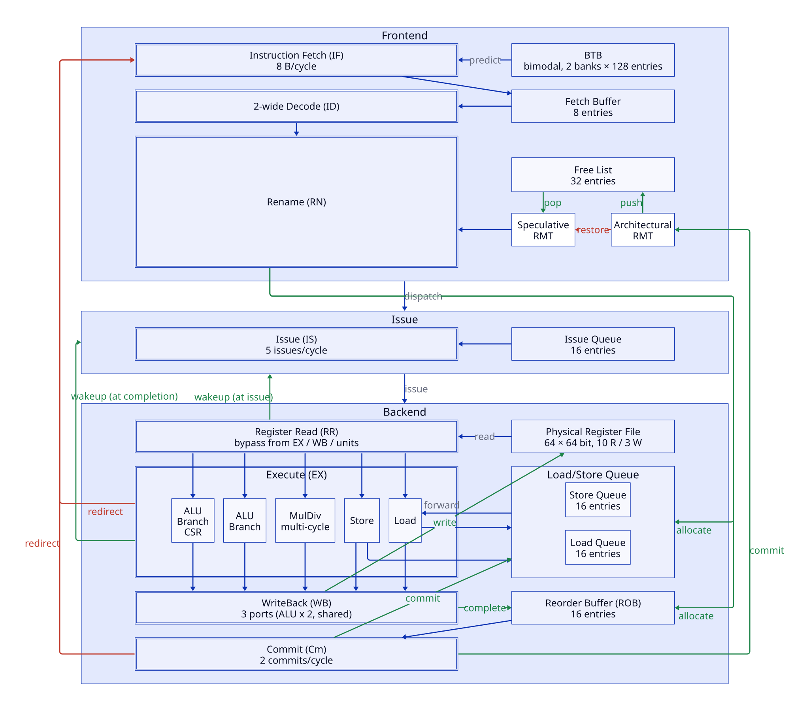

# Cuintet

[](https://github.com/atree4728/cuintet/actions/workflows/ci.yml)

*Cuintet* is a:
- 8-stage pipelined,
- 2-way superscalar,
- out-of-order,
- RISC-V (`RV64IM_Zicsr`) CPU
- written in [Clash](https://clash-lang.org/).



## Building and testing

```sh
cabal build
cabal test             # unit tests (riscv-tests etc.) and doctests
cabal bench            # cycles and IPC of each benchmark
cabal run clashi       # REPL
cabal haddock --open   # API docs
```

## Debugging

The recipes below need [just](https://github.com/casey/just).

```sh
just konata IMAGE.elf     # write a Kanata log to build/konata/
just tracediff IMAGE.elf  # diff the retire trace against spike's
```

## Synthesis

Each top entity lives in its own module under `Cuintet.Top`. The recipes below
write to `build/`, and all but `hdl` need
[oss-cad-suite](https://github.com/YosysHQ/oss-cad-suite-build) on `PATH`.

```sh
just tangnano9k::hdl     # SystemVerilog, in build/systemverilog/
just timing::fmax        # fmax and critical path on an ECP5
just tangnano9k::prog    # load the bitstream into the Tang Nano 9K's SRAM
just tangnano9k::flash   # write it to the on-board flash
```
